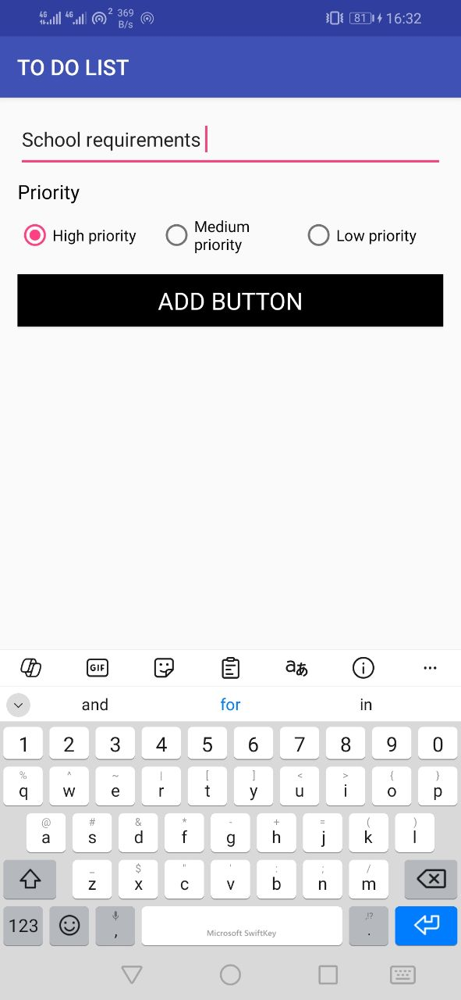
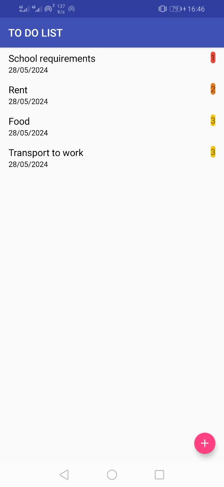

This is a to-do list application designed with Room, LiveData, and ViewModel, supported on Android version 7 and above. 
The compileSdkVersion is 34, the targetSdkVersion is 33, and Gradle version 7.1.3 is used.

